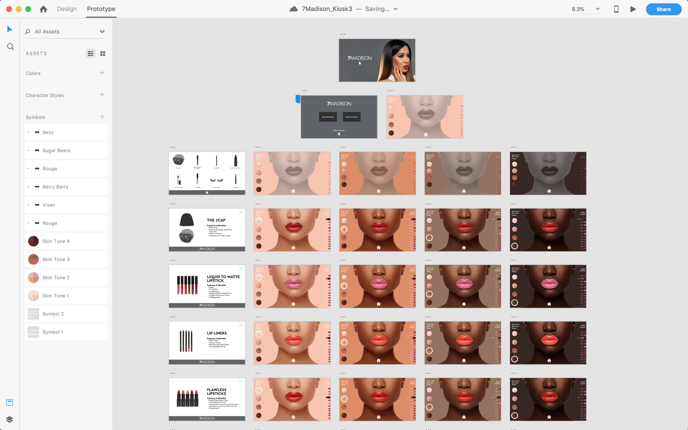

<strong>When:</strong> 2019 &nbsp;<strong>Role:</strong> Interaction Design

<iframe width="560" height="315" src="https://www.youtube.com/embed/n2cAOgugtu8" frameborder="0" allow="accelerometer; autoplay; encrypted-media; gyroscope; picture-in-picture" allowfullscreen></iframe>

<iframe width="560" height="315" src="https://www.youtube.com/embed/eEqWiAv8AiA" frameborder="0" allow="accelerometer; autoplay; encrypted-media; gyroscope; picture-in-picture" allowfullscreen></iframe>

<h4>Responsibilites</h4>

Lorem ipsum dolor sit amet, consectetur adipiscing elit. Vestibulum dictum ultricies rhoncus. Nulla facilisi. Etiam vel porta augue. Praesent ac ultrices magna, nec rutrum velit.

<h4>Objectives</h4>

Lorem ipsum dolor sit amet, consectetur adipiscing elit. Vestibulum dictum ultricies rhoncus. Nulla facilisi. Etiam vel porta augue. Praesent ac ultrices magna, nec rutrum velit.

<h4>Process</h4>

Lorem ipsum dolor sit amet, consectetur adipiscing elit. Vestibulum dictum ultricies rhoncus. Nulla facilisi. Etiam vel porta augue. Praesent ac ultrices magna, nec rutrum velit.

<h4>Take Away's</h4>

Lorem ipsum dolor sit amet, consectetur adipiscing elit. Vestibulum dictum ultricies rhoncus. Nulla facilisi. Etiam vel porta augue. Praesent ac ultrices magna, nec rutrum velit.

